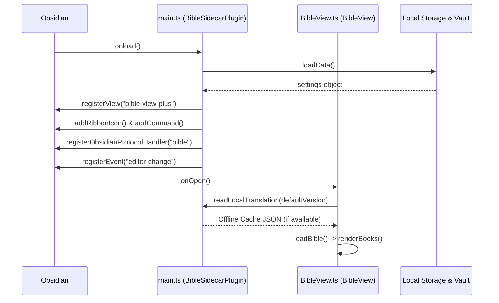

# System Data Flow Tracing

This document outlines the detailed step-by-step data flows for key runtime operations in the **Bible Sidecar Plus** plugin.

---

## 1. Boot-up & Initialization Flow

When Obsidian loads the plugin, the environment is initialized as follows:



1. **Settings Loading**: `main.ts` calls `loadSettings()`, reading settings from the plugin's data folder via Obsidian's API. If no data exists, `DEFAULT_SETTINGS` is merged.
2. **View Registration**: `onload()` calls `registerView()`, binding the view identifier `bible-view-plus` to a callback that constructs the `BibleView` instance.
3. **Protocols & Key Listeners**: Registers the deep-link handler `obsidian://bible` and the `editor-change` event listener in Obsidian.
4. **Rendering Initial State**: `BibleView.onOpen()` captures the active window (supporting popout windows), registers online/offline DOM event listeners, and calls `loadBible()` to fetch book listings and display the primary Books tab grid.

---

## 2. Passage Navigation & Scrolling Flow

When a user clicks on a book, chapter, or deep link:

```text
User Actions / Protocol URI Link
             │
             ▼
 BibleView.ts: navigateToPassage(book, chapter, verse, endVerse)
             │
             ├──► [Offline Check]: Is the targeted chapter cached locally?
             │                     No  ──► Display Notice warning & Abort.
             │                     Yes ──► Continue
             ▼
 BibleView.ts: getChapterContent()
             │
             ├──► 1. Check local Offline Cache
             ├──► 2. [Online Fallback]: Fetch from ESV API, API.Bible, or Bolls.life
             ├──► 3. [Auto-Cache]: Save fetched chapter back to local cache
             ▼
 BibleView.ts: processChapterContent()
             │
             ├──► Parse raw HTML (DOMParser) or raw JSON lists
             ├──► Format red-letter stanzas in DOM if Gospels quotes active
             ├──► Inject structured verses into .chapter-container DOM
             ▼
 Scroll & Highlight Timeout
             │
             ├──► Locate matching DOM element via [data-verse="X"] or superscript search
             ├──► Apply CSS class .active-verse (handles nested span exclusions)
             └──► Trigger DOM.scrollIntoView() to center target verse in viewport
```

- **Scroll Memory Handling**: Before transitioning between views (e.g. books -> chapters -> verses), the active scroll height is recorded in `this.savedScrollPositions[currentView]`. When rendering finishes, `restoreScrollPosition(view)` forces a DOM layout reflow and snaps the viewport back to the saved height.

---

## 3. Custom Highlighter, Notes & Sync Flow

When selection is made and highlighted:

```text
User Selects Text in View Pane
             │
             ▼
 BibleView.ts: Selection Event Listener -> Floating toolbar appears
             │
             ▼
 User clicks Color Dot (Yellow/Green/Blue/Pink/Null)
             │
             ├──► Note Prompt? (Modal popup allows multi-line text input)
             ▼
 BibleView.ts: applyHighlight(book, chapter, verseRange, color, selectedText, noteText)
             │
             ▼
 utils.ts: updateAnnotationsData(settings.annotationsData, color, selectedText, ...)
             │
             ├──► [Null Color]: Scan and delete overlapping single/range highlight keys
             └──► [Color Selected]: Write new/merged annotation record into config memory
             ▼
 main.ts: saveSettings() (Debounced by 400ms)
             │
             ├──► 1. Write updated JSON data to Obsidian Vault settings disk
             ├──► 2. main.ts: syncAnnotationsToVault()
             │      │
             │      └──► Format Markdown list entries grouped by Book
             │      └──► Generate deep link Obsidian URI back to active passage
             │      └──► Write/Modify annotation Markdown file (default: bible-annotations.md)
             │
             ▼
 BibleView.ts: updateBibleViewSettings() -> applySavedHighlights()
             │
             ├──► Clear old highlight spans and note badges from the active DOM
             └──► Repaint DOM using the centralized, unified paint path
```

---

## 4. Auto-Expand Reference Replacements Flow

As a user types in a standard Obsidian document note:

```text
User Types "--John 3:16 +p " in Editor
             │
             ▼
 main.ts: Editor Change Event Triggered
             │
             ├──► Check if cursor is immediately preceded by AUTO_EXPAND_REGEX
             ▼
 Parse matches: Book="John", Chapter=3, Verse=16, Flag="p", referenceText="[[John]] [3:16](...)"
             │
             ▼
 main.ts: Replace typed match range with temporary "[Fetching John 3:16...]" placeholder
             │
             ▼
 main.ts: fetchAndReplaceBibleText()
             │
             ├──► 1. Read local Offline Cache for active Bible Version
             ├──► 2. [Fallback]: Request online endpoint (ESV API -> API.Bible -> Bolls.life)
             ├──► 3. [Parse HTML]: Extract verse text spans, stripping styling divs
             ▼
 utils.ts: compileAutoExpandOutput()
             │
             ├──► Apply red-letter words formatting (if Gospels)
             ├──► Apply markdown styles (italics/bold) based on flag and configuration
             ├──► Wrap output in custom Callout Block if flag templates define it
             ▼
 main.ts: editor.replaceRange()
             │
             └──► Swap temporary placeholder with formatted scripture block in note
```

---

## 5. Advanced Query Search Flow

When using the Search tab in the Bible Sidecar view:

```text
User Types advanced query: '"eternal life" -condemn ot:psalm'
             │
             ▼
 utils.ts: parseAdvancedSearchQuery(query)
             │
             ├──► Extract exact phrases in quotes: ["eternal life"]
             ├──► Extract negative exclusions: ["condemn"]
             ├──► Extract testament filter: "ot"
             └──► Extract book prefix scope filter: "PSA" (Psalm)
             ▼
 utils.ts: searchBibleLocalData()
             │
             ├──► Read active local Offline Cache
             ├──► Loop books -> chapters -> verses
             │      │
             │      ├──► Match filters (Exclusions, Testament, Book Prefix)
             │      └──► Verify presence of phrases and included terms
             ▼
 Render Results List (capped at 150 entries)
             │
             └──► Clicking a result triggers navigateToPassage() to scroll to verse
```

---

## 6. Offline Bible Version Downloader Flow

How Bible Versions are downloaded and stored for complete offline functionality:

1. **Downloader Trigger**: In settings, clicking `Download [Version]` initiates `downloadTranslation(version)`.
2. **Book Map Retrieval**: Requests `get-books/[Version]` from Bolls.life (or API.Bible books list).
3. **Task Queue Assembly**: Builds a flat queue of tasks representing every chapter (e.g. 1,189 chapters for standard Protestant Bibles).
4. **Concurrent Batch Fetching**: Processes tasks in concurrent groups of `10` requests:
   - Fetches Bolls.life JSON, ESV API HTML, or API.Bible HTML.
   - Pushes returned verses into a local cache object.
   - Calls the `onProgress` callback to update the settings UI button percentage label.
5. **Local JSON Write**: Once progress reaches 100%, the full cache structure is serialized and written to:
   `${pluginDir}/translations/${VERSION}.json`
6. **On-Demand Auto-Caching**: For premium providers (ESV / API.Bible) where bulk downloads are rate-limited, chapters are downloaded individually during online traversal and appended to the JSON cache via `cachePassageLocally()`.
