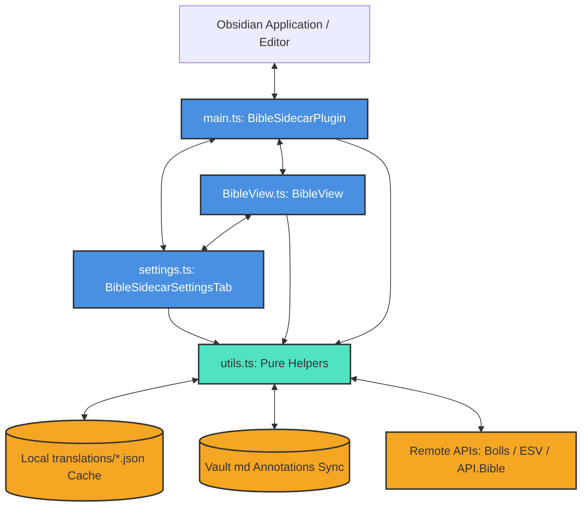

# System Architecture Overview

This document provides a high-level overview of the architectural design, directory layout, technology stack, and component interactions of the **Bible Sidecar Plus** Obsidian plugin.

---

## 1. High-Level Architecture

Bible Sidecar Plus is built as a standard Obsidian plugin extending the Obsidian API. It registers a workspace sidecar panel (`BibleView`) that displays Bible books, chapters, and verses in a split-screen view next to standard Obsidian notes.

Key features (such as auto-expanding typed Bible references, syncing highlights and notes to a local vault Markdown file, and managing downloaded translation databases) are coordinated through the main plugin entry point and backed by pure utility functions.



---

## 2. Technology Stack

- **Core Language**: TypeScript compiled to JavaScript (ES6).
- **Styling**: Vanilla CSS (`styles.css`) for layout structure, glassmorphic UI accents, and mobile spacing.
- **Build/Bundling Tool**: ESBuild (`esbuild.config.mjs`) configured to generate the unified release files (`main.js` and `styles.css`).
- **Testing Runner**: Custom lightweight testing script (`run-tests.ts`) run inside a bundled Node.js environment to isolate unit tests from Obsidian desktop app API dependencies.
- **Remote APIs**:
  - **Bolls.life**: Public API used to download standard translation text packages (e.g., KJV, YLT) for offline storage.
  - **Crossway ESV API**: Premium authenticated API for retrieving rich ESV HTML (including stanzas and red-letter text).
  - **API.Bible**: Premium authenticated API for multi-version scripture retrieval with advanced paragraph layouts.

---

## 3. Directory Layout

```text
bible-sidecar-plus/
├── .github/                  # CI/CD Workflows
│   └── workflows/
│       └── release.yml       # Release packaging and asset uploading
├── .meta/                    # Architectural guidelines and ADR history
│   ├── overview.md           # [This File] High-level system overview
│   ├── data_flow.md          # Runtime operation tracing
│   ├── architectural_decisions.md # Architecture Decision Records (ADRs)
│   ├── constraints_and_rules.md # Rules for future development
│   ├── instructions.md       # AI Agent Checklist
│   └── design-philosophies.md# Legacy design statements
├── translations/             # Git-ignored cache folder for offline JSON databases
├── BibleView.ts              # Obsidian Pane View (UI, navigation, highlighting)
├── main.ts                   # Main Plugin Entry Point & Obsidian Command Bindings
├── settings.ts               # Settings Panel UI & Offline Translation Manager
├── utils.ts                  # Pure, platform-independent business logic utilities
├── styles.css                # Global and pane-specific layouts & animations
├── tsconfig.json             # TypeScript compilation settings
├── package.json              # Script automation and NPM package references
└── README.md                 # Public documentation and onboarding
```

---

## 4. Entry Points & Core Components

### 1. Main Entry Point (`main.ts`)
- **Class**: `BibleSidecarPlugin` (extends `Plugin`)
- **Responsibilities**:
  - Plugin lifecycle management (`onload()`, `onunload()`).
  - Loading and debouncing saved settings.
  - Registering workspace pane (`BibleView`), ribbon icons, commands, and URI protocol handlers (`obsidian://bible`).
  - Intercepting the `editor-change` event to process auto-expand typing shortcuts.
  - Syncing annotations to the local vault Markdown file (`bible-annotations.md`).

### 2. View Controller (`BibleView.ts`)
- **Class**: `BibleView` (extends `ItemView`)
- **Responsibilities**:
  - Rendering the sidebar HTML, including tabs for Book browsing, Search query, and Settings.
  - Book listing layout with collapsible testament accordions and quick filters.
  - Verses paragraph rendering, parallel text columns, and custom phrase-level text selection listener.
  - Uniform DOM highlighting and note badge painting (`applySavedHighlights()`).
  - Active network connectivity probes (pinging `1.1.1.1` via HEAD requests) and setting inline offline states.
  - In-memory view scroll position memory cache (`savedScrollPositions`) to prevent page jumps during back-and-forth traversal.

### 3. Settings UI (`settings.ts`)
- **Class**: `BibleSidecarSettingsTab` (extends `PluginSettingTab`)
- **Responsibilities**:
  - Building the Obsidian Settings page UI.
  - API key connection status validators (connection tests with immediate visual success/error notices).
  - Collapsible option panels (Premium API dropdowns, Callout template customizers).
  - Downloader buttons executing batch chapter fetches from online translation endpoints to write local database files.

### 4. Pure Business Logic (`utils.ts`)
- **Responsibilities**:
  - Houses pure functions that can be executed and tested without mock Obsidian APIs or browser mock engines.
  - RegEx compilers (`AUTO_EXPAND_REGEX`, `SELECTION_REGEX`).
  - Verse selection copy string compiler (`compileCopyMessage`).
  - Advanced search query parser (`parseAdvancedSearchQuery`) and matched text filtering.
  - Array mapping helper updating offline JSON translation blocks (`updateLocalCacheData`).
