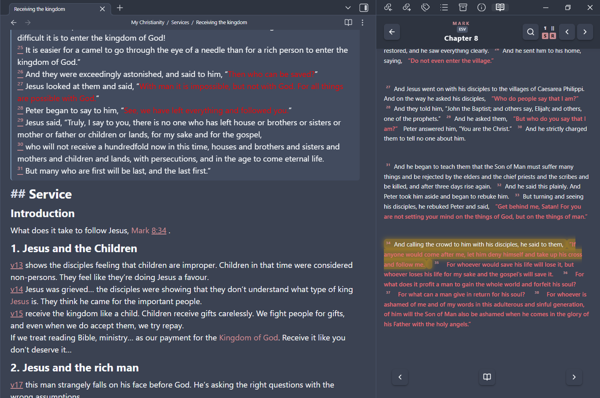
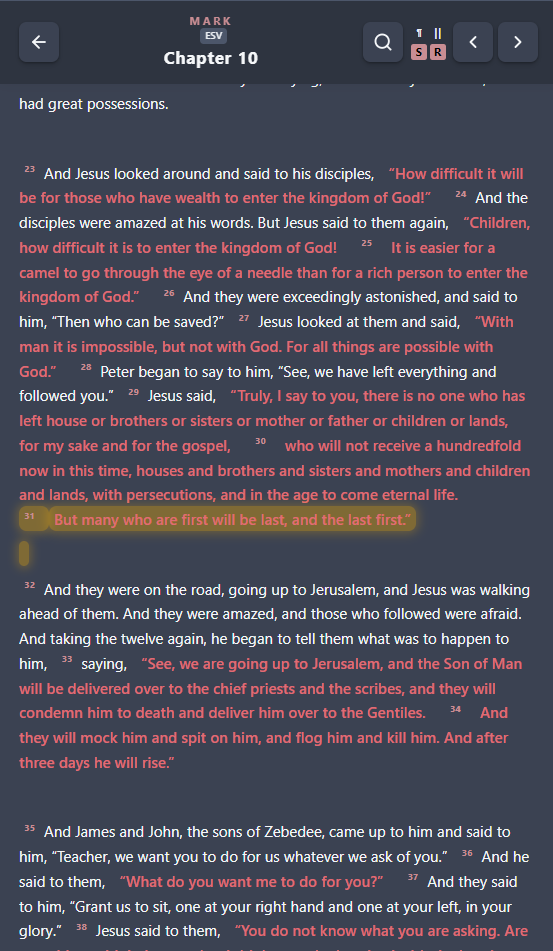
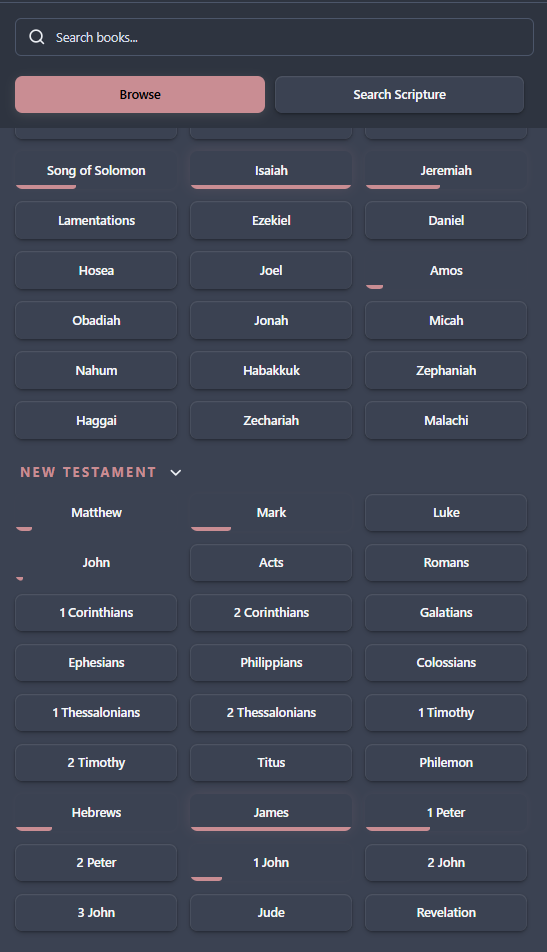

# 📖 Bible Sidecar Plus for Obsidian

[](https://obsidian.md)
[](https://github.com/Chosen-Emperor/bible-sidecar-obsidian-plugin/releases)
[](#-development)
[](LICENSE)

A premium, feature-rich **Bible Reader and Study Panel** for Obsidian. This is an enhanced fork of the original [Bible Sidecar](https://github.com/janisringli/bible-sidecar-obsidian-plugin) plugin, rewritten to support robust local **Offline Caching**, a high-performance **Offline Search Engine**, and responsive touch layouts for both Desktop and Mobile.

Designed to feel responsive, fast, and native across **Windows, macOS, Linux, iPad, iOS, and Android**.

<p align="center"></p>

---

## ✨ Features

### ⚡ Split-Screen Bible Sidecar
* **Side-by-Side Reading**: Keep your active notes open on the left and read scriptures in a split-screen view on the right.
* **Dual Translation Parallel View**: Compare two versions side-by-side (e.g., KJV & ESV). If your screen or pane becomes narrow (under `480px`), the layout automatically collapses into a tabbed layout for an optimal mobile experience.

<p align="center"></p>

### 🔍 Advanced Offline Search Engine
* Search your downloaded translations instantly using logical operators:
  * `loved world` — matches verses containing both terms.
  * `"only Son"` — searches for the exact phrase.
  * `world -condemn` — filters out verses containing "condemn".
  * `ot:light` / `nt:light` — restricts search to the Old or New Testament.
  * `JHN:world` — restricts search to a specific book (using standard 3-letter codes).

### 📝 Auto-Expand Shortcuts (IntelliSense)
Easily insert scripture and reference links directly inside your note editor using the native autocomplete suggest menu:
* **Trigger Prefix**: Type `--` followed by a book name (e.g. `--John 3:16`) to open the dropdown suggestions list.
* **Dropdown Selection Modes**:
  * **Link** (default) $\rightarrow$ Inserts a clean markdown link (e.g. `[[John 3:16]]`).
  * **Passage** (`p`) $\rightarrow$ Inserts the scripture text with superscript links, followed by the reference link at the bottom.
  * **Quote** (`q`) $\rightarrow$ Inserts the scripture text (ideal for short, inline quotes).
  * **List** (`l`) $\rightarrow$ Inserts each verse on a new line with its superscript link, followed by the reference link at the bottom.
* **Quick Suffix Filtering**: Type `--John 3:16p` (or `+p`), `--John 3:16q`, or `--John 3:16l` to filter directly to that style, then press **Enter** or **Tab** to expand.
* **IntelliSense Auto-Complete**: Type `--John 3:` to pick from list of verses, or type `--John 3:16-` to select from consecutive verse ranges.
* **Double-Enter Spam Lock**: Safety locking built-in to prevent double-insertions or duplication even if you spam the enter key.

### 🔴 Words of Christ in Red (Gospel Accents)
* Automatically highlights all spoken words of Jesus in **red** inside the Gospels (Matthew, Mark, Luke, John). Compatibility is built-in for modern translations using standard quotation styles (e.g., ESV, NIV, NLT, NASB).

### 🌐 Offline Downloader & Outage Protection
* **Download Manager**: Save complete translations locally (via Bolls.life) for full offline search and reading.
* **Outage Fallback**: If you're using online APIs (like Crossway's ESV or API.Bible) and your internet drops, the plugin automatically switches to your offline cached fallback to prevent disruptions.

<p align="center"></p>

### 🏷️ Translation Version Indicators
* Optional small version badges (e.g., `ESV` or `KJV`) displayed inside the Sidecar navigation header.
* Appends active version tags inside Callout expansions (e.g. `[!quote] John 3:16 (ESV)`) so you always know which translation is referenced in your study notes.

---

## 🎨 Visual Preview of Expansion Modes

Here is what expansions look like inside your note editor after selecting them from the suggest dropdown:

### Passage Suffix (`p` or `+p`)
Inserts full scripture text with superscript links and appends the reference link at the bottom:
<p align="center"></p>

### Quote Suffix (`q` or `+q`)
Inserts the scripture text only:
<p align="center"></p>

### List Suffix (`l` or `+l`)
Inserts each verse on a new line with its superscript link, followed by the reference link at the bottom:
<p align="center"></p>

---

## 📦 Installation

### Option 1: Via Obsidian BRAT (Recommended for Beta Testing)
1. Install the **BRAT** (Beta Reviewer's Auto-update Tool) plugin from the Obsidian Community Plugins directory.
2. Enable BRAT in your settings.
3. Open the command palette (`Ctrl+P` or `Cmd+P`) and select `BRAT: Add a beta plugin for testing`.
4. Paste the repository URL: `https://github.com/Chosen-Emperor/bible-sidecar-obsidian-plugin`
5. Click **Add Plugin** and enable **Bible Sidecar Plus** in your Community Plugins settings.

### Option 2: Manual Installation
1. Go to the [Releases](https://github.com/Chosen-Emperor/bible-sidecar-obsidian-plugin/releases) page and download the latest version zip containing `main.js`, `manifest.json`, and `styles.css`.
2. Extract the files and move them into a new folder named `bible-sidecar-plus` inside your vault's `.obsidian/plugins/` directory.
3. Reload Obsidian or click **Reload plugins** under settings, then enable the plugin.

---

## 🚀 How to Use

1. **Open the Sidecar**: Click the **Bible Icon** in the ribbon sidebar or run the Command Palette (`Open Bible Sidecar`).
2. **Offline Mode**: Navigate to settings, go to the **Translations & API Keys** tab, choose your version, and hit **Download** to cache the translation locally.
3. **Copying Verses**:
   * Click the **Copy Icon** next to any verse to copy it using your active formatting settings.
   * Highlight text directly in the Sidecar, press `Ctrl+C` / `Cmd+C`, and the copied text will automatically append the correct passage reference link!
4. **Drag & Drop**: Grab the superscript number of any verse in the Sidecar and drag it directly into your note editor.
5. **Auto-Suggestions**: Type `--` followed by a book name (e.g., `--Romans 8:28`) and select options from the suggestion list.

---

## ⚙️ Settings Configuration

The settings panel is organized into clean, easy-to-use tabs:

| Tab Section | Customizable Features |
| :--- | :--- |
| **General** | Configure language settings, book abbreviations, and toggle separate/paragraph verse layout modes. |
| **Translations & API Keys** | Setup connection keys for **Crossway's ESV API** or **API.Bible** (allowing poetry/indents), and download offline translation packages. |
| **Copy Options** | Setup clipboard copy behaviors, wiki-linking (`[[John]]`), reference styles (e.g. prefix `> ` or `-`), and callout settings. |
| **Auto-Expand Options** | Customize trigger prefixes (`--` or `//`), toggle word descriptors, and set up colors, titles, and styles for `+p`, `+l`, and `+q` expansions. |
| **Study Tools** | Turn on Jesus's words in red, toggle Strong's concordance numbers, and adjust cross-references. |

---

## 🛠️ Development & Contributing

If you want to build and modify the plugin locally:

1. Clone the repository:
   ```bash
   git clone https://github.com/Chosen-Emperor/bible-sidecar-obsidian-plugin.git
   cd bible-sidecar-obsidian-plugin
   ```
2. Install the developer dependencies:
   ```bash
   npm install
   ```
3. Run the development server (auto-recompiles on file edits):
   ```bash
   npm run dev
   ```
4. Build the final optimized production bundle:
   ```bash
   npm run build
   ```
5. Run the unit test suite:
   ```bash
   npm run test
   ```
6. Run the online API compliance test suite (verifies compatibility with remote endpoints):
   ```bash
   npm run test:api
   ```


---

## 🤝 Contributing

Contributions are always welcome! If you encounter a bug, have a feature suggestion, or want to improve styles/translations, feel free to open a Pull Request or create an issue in our [GitHub Issues](https://github.com/Chosen-Emperor/bible-sidecar-obsidian-plugin/issues) page.

---

> [!NOTE]
> **Credits & Authorship**
> - Originally created and developed by [Janis Ringli](https://github.com/janisringli). (If you appreciate the core plugin, consider [buying him a coffee](https://buymeacoffee.com/janisringli)!)
> - Enhanced and maintained by [Chosen-Emperor](https://github.com/Chosen-Emperor) with mobile compatibility, offline caching, and layout polishing, developed in collaboration with AI assistance.
